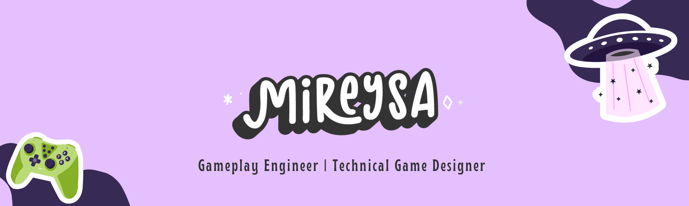

 

 

 
---
I'm Mireysa. I’m a Gameplay Engineer and Technical Game Designer who builds the systems and mechanics that bring games to life. My background is in enterprise software engineering, where I developed a strong foundation in clean, modular architecture and thoughtful system design. I bring that same discipline into my game development work, while also exploring level design and shader development on the side.

At heart, I’m a lifelong gamer. I love action RPGs, shooters, simulators, and indie gems, and I’m always interested in understanding what makes a game feel great to play.

**I build things in the Pixel Aether.**